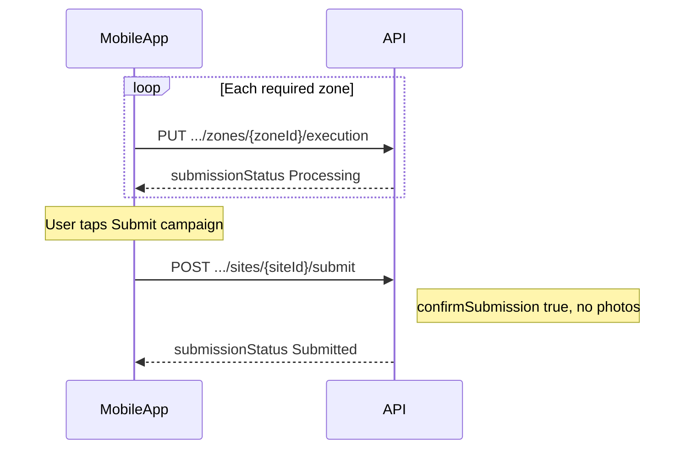

# Finalize Site Execution API (Campaign Submission)

## Overview

This endpoint lets a merchandiser **declare that VM campaign execution is complete** for one site (boutique).

It does **not** upload photos. Zones and photos must already be saved via:

`PUT /api/VmCompaign/{campaignId}/sites/{siteId}/zones/{zoneId}/execution`

On success, `VmExecutionSubmission.Status` moves from **`Processing`** to **`Submitted`**, campaign statuses are recomputed, and a timeline activity **« Campagne soumise »** is recorded.



## Endpoint

| Property | Value |
| --- | --- |
| **Method** | `POST` |
| **Route** | `/api/VmCompaign/{campaignId}/sites/{siteId}/submit` |
| **Controller** | `VmCompaignController.FinalizeSiteExecution` |
| **Service** | `VmCompaignService.FinalizeSiteExecutionAsync` |
| **Authorization** | `RequireVMLeadOrMerchandiser` |

### Authorization

The caller must be authenticated with a JWT that includes one of:

- `IsVisualMerchandisingLead` = `"True"`
- `IsVisualMerchandiser` = `"True"`

The user id is read from claims (`userId`, `UserID`, `NameIdentifier`, or `Name`) and stored on the submission when finalize succeeds.

## Path Parameters

| Name | Type | Required | Description |
| --- | --- | --- | --- |
| `campaignId` | `int` | Yes | Campaign identifier (`VmCompaign.Id`) |
| `siteId` | `int` | Yes | Boutique/site identifier |

## Request Body

`Content-Type: application/json`

**No photos or zone payloads.** Only a confirmation flag and optional metadata.

```json
{
  "campaignId": 1009,
  "siteId": 42,
  "confirmSubmission": true,
  "submittedAt": "2026-05-18T12:00:00Z",
  "meta": {
    "appVersion": "2.1.0",
    "platform": "ios"
  }
}
```

### Request Fields

| Field | Type | Required | Description |
| --- | --- | --- | --- |
| `campaignId` | `int` | Yes | Must match `{campaignId}` in the route |
| `siteId` | `int` | Yes | Must match `{siteId}` in the route |
| `confirmSubmission` | `bool` | Yes | Must be **`true`** to finalize |
| `submittedAt` | `datetime` | No | Submission timestamp (UTC). Used for campaign window validation. Server also sets `VmExecutionSubmission.SubmittedAt` to current UTC on success |
| `meta` | `object?` | No | Client metadata stored on the submission |
| `meta.appVersion` | `string?` | No | Mobile app version |
| `meta.platform` | `string?` | No | e.g. `android`, `ios` |

### Important

- Do **not** use `IsValidated` on this request — that flag on `VmExecution` is reserved for **VM Lead review** (`POST .../executions/{executionId}/review`).
- This endpoint replaces the legacy bulk submit that sent all zones and photos in one body.

## Prerequisites

Before calling finalize, the client should ensure:

1. At least one `PUT` zone execution has been performed (a `VmExecutionSubmission` exists for this site).
2. **Every required zone** of the campaign has a `VmExecution` in the current submission with **at least one photo**.

Required zones come from all `VmGuidelineZoneAssignment` rows linked to the campaign guidelines.

Use `GET /api/VmCompaign/{campaignId}/sites/{siteId}/executions` or the `siteProgress` / `allZonesReadyForFinalize` fields from the last zone `PUT` response to verify readiness.

## Success Response (`200 OK`)

### First-time finalize

```json
{
  "success": true,
  "submissionId": "sub_a1b2c3d4e5f6",
  "submissionStatus": "Submitted",
  "campaignStatus": "InProgress",
  "campaignReviewStatus": "PendingReview",
  "processedZones": 5,
  "processedPhotos": 12,
  "message": "Campaign submitted successfully.",
  "errors": [],
  "incompleteZoneIds": [],
  "siteProgress": {
    "requiredZones": 5,
    "completedZones": 5,
    "progressPercent": 100,
    "allZonesComplete": true,
    "incompleteZoneIds": []
  }
}
```

### Idempotent call (already submitted)

If the submission is already `Submitted`, the API returns **`200 OK`** (not an error):

```json
{
  "success": true,
  "submissionId": "sub_a1b2c3d4e5f6",
  "submissionStatus": "Submitted",
  "campaignStatus": "InProgress",
  "campaignReviewStatus": "PendingReview",
  "processedZones": 5,
  "processedPhotos": 12,
  "message": "Campaign was already submitted for this site.",
  "errors": [],
  "incompleteZoneIds": [],
  "siteProgress": {
    "requiredZones": 5,
    "completedZones": 5,
    "progressPercent": 100,
    "allZonesComplete": true,
    "incompleteZoneIds": []
  }
}
```

### Response Fields

| Field | Type | Description |
| --- | --- | --- |
| `success` | `bool` | `true` on successful finalize or idempotent already-submitted |
| `submissionId` | `string?` | Public submission reference (e.g. `sub_a1b2c3d4e5f6`) |
| `submissionStatus` | `string?` | `Submitted` after finalize |
| `campaignStatus` | `string?` | Global campaign status after recompute (`Planified`, `InProgress`, `Completed`, `Cancelled`) |
| `campaignReviewStatus` | `string?` | Review aggregate status (`PendingReview`, `Approved`, `Disapproved`) — not set to approved by finalize |
| `processedZones` | `int` | Number of required zones completed (with photos) |
| `processedPhotos` | `int` | Total photos across all zone executions in this submission |
| `message` | `string` | Localized success or idempotent message |
| `errors` | `array` | Empty on success |
| `incompleteZoneIds` | `int[]` | Zone IDs still missing photos (empty on success) |
| `siteProgress` | `object?` | Site completion snapshot |

### `siteProgress` Object

| Field | Type | Description |
| --- | --- | --- |
| `requiredZones` | `int` | Total required zones for the campaign |
| `completedZones` | `int` | Zones with at least one photo in the current submission |
| `progressPercent` | `double` | `completedZones / requiredZones * 100` |
| `allZonesComplete` | `bool` | `true` when finalize is allowed |
| `incompleteZoneIds` | `int[]` | Required zone IDs without photos |

### `submissionStatus` Lifecycle (merchandiser vs review)

| Value | Meaning |
| --- | --- |
| `Pending` | Submission record created, little or no work yet |
| `Processing` | At least one zone saved; merchandiser still working or correcting |
| `Submitted` | **Set by this endpoint** — merchandiser declared completion |
| `Validated` | Set after VM Lead approves all required zones (review flow) |
| `Rejected` | Set when review or processing fails |

## Business Rules

1. **Explicit confirmation** — `confirmSubmission` must be `true`.
2. **Submission must exist** — Created by the first zone `PUT`; otherwise `NoSubmissionInProgress`.
3. **All zones required** — Every campaign-required zone must have photos in the current submission; otherwise `IncompleteZones`.
4. **Campaign window** — `submittedAt` date must fall within `[StartDate, EndDate]`; cancelled campaigns are rejected.
5. **No photo upload** — This endpoint only changes submission and campaign status metadata.
6. **Campaign recompute** — `VmCompaign.status` and `reviewStatus` are recalculated after a successful finalize (multi-site rules apply).
7. **Locked after VM validation** — If submission status is `Validated`, finalize and zone edits are blocked.
8. **Re-edit after submit** — A later zone `PUT` while `Submitted` reopens the submission to `Processing`; the merchandiser must call finalize again.

## Error Responses

### `400 Bad Request` — Invalid payload

```json
{
  "success": false,
  "message": "Invalid request payload."
}
```

### `400 Bad Request` — Confirmation required

`confirmSubmission` is `false` or missing.

```json
{
  "success": false,
  "message": "confirmSubmission must be true to finalize the campaign."
}
```

### `400 Bad Request` — No submission in progress

No `VmExecutionSubmission` for this campaign/site (no zone saved yet).

```json
{
  "success": false,
  "message": "No submission in progress for this site. Save at least one zone first."
}
```

### `400 Bad Request` — Incomplete zones

Not all required zones have photos.

```json
{
  "success": false,
  "submissionId": "sub_a1b2c3d4e5f6",
  "submissionStatus": "Processing",
  "campaignStatus": "InProgress",
  "campaignReviewStatus": "PendingReview",
  "processedZones": 2,
  "processedPhotos": 5,
  "message": "All required zones must have at least one photo before finalizing.",
  "incompleteZoneIds": [3, 4, 5],
  "siteProgress": {
    "requiredZones": 5,
    "completedZones": 2,
    "progressPercent": 40,
    "allZonesComplete": false,
    "incompleteZoneIds": [3, 4, 5]
  },
  "errors": [
    { "zoneId": 3, "code": "INCOMPLETE_ZONES" },
    { "zoneId": 4, "code": "INCOMPLETE_ZONES" },
    { "zoneId": 5, "code": "INCOMPLETE_ZONES" }
  ]
}
```

### `400 Bad Request` — Path/body mismatch

`campaignId` or `siteId` in the body does not match the route.

```json
{
  "success": false,
  "message": "Path and payload campaign/site IDs are inconsistent."
}
```

### `400 Bad Request` — Submission locked

Submission already validated by VM Lead review.

```json
{
  "success": false,
  "message": "This submission has been validated and can no longer be modified."
}
```

### `400 Bad Request` — Campaign closed or out of window

| Condition | Typical `message` key |
| --- | --- |
| Campaign cancelled | `CampaignClosed` |
| Date outside `[StartDate, EndDate]` | `CampaignOutOfWindow` |

### `404 Not Found`

| Condition | `message` |
| --- | --- |
| Campaign does not exist | `CampaignNotFound` |
| Site not assigned to campaign | `CampaignOrSiteNotFound` |

### `500 Internal Server Error`

```json
{
  "success": false,
  "message": "An internal error occurred while processing the submission."
}
```

## Side Effects on Success

| Entity | Change |
| --- | --- |
| `VmExecutionSubmission` | `Status = Submitted`, `SubmittedAt` updated, `IsSuccess = true`, `ProcessedZones` / `ProcessedPhotos` updated |
| `VmCompaign` | `status` and `reviewStatus` recomputed |
| `VmSubmissionActivities` | New row: type `Submission`, title « Campagne soumise » |

## Related Endpoints

| Method | Route | Purpose |
| --- | --- | --- |
| `PUT` | `/api/VmCompaign/{campaignId}/sites/{siteId}/zones/{zoneId}/execution` | Save or update zone photos (keeps submission in `Processing`) |
| `GET` | `/api/VmCompaign/{campaignId}/sites/{siteId}/executions` | List zones and progress before finalize |
| `GET` | `/api/VmCompaign/{campaignId}/sites/{siteId}/execution-details` | Detailed view after submit |
| `POST` | `/api/VmCompaign/executions/{executionId}/review` | VM Lead approves or rejects a zone |

See also: [submit_zone_execution_api.md](submit_zone_execution_api.md) for zone PUT documentation.

## Example Request

```http
POST /api/VmCompaign/1009/sites/42/submit HTTP/1.1
Authorization: Bearer <token>
Content-Type: application/json

{
  "campaignId": 1009,
  "siteId": 42,
  "confirmSubmission": true,
  "submittedAt": "2026-05-18T12:00:00Z",
  "meta": {
    "appVersion": "2.1.0",
    "platform": "ios"
  }
}
```

## Client Integration Checklist

1. Complete all required zones via zone `PUT` calls.
2. Confirm `allZonesReadyForFinalize` is `true` (from last PUT or `GET .../executions`).
3. Show a confirmation dialog (« Submit campaign? »).
4. Call this endpoint with `confirmSubmission: true`.
5. On `200` + `submissionStatus: Submitted`, navigate to summary or execution-details.
6. Handle `IncompleteZones` by directing the user to missing zones listed in `incompleteZoneIds`.

## Source Files

| File | Role |
| --- | --- |
| [Controllers/VmCompaignController.cs](Controllers/VmCompaignController.cs) | `FinalizeSiteExecution` action |
| [Services/VmCompaignService/VmCompaignService.cs](Services/VmCompaignService/VmCompaignService.cs) | `FinalizeSiteExecutionAsync` |
| [Services/VmCompaignService/IVmCompaignService.cs](Services/VmCompaignService/IVmCompaignService.cs) | Service contract |
| [DTO/VmCompaignDtos/SubmitExecutionDtos/SubmitCampaignExecutionDtos.cs](DTO/VmCompaignDtos/SubmitExecutionDtos/SubmitCampaignExecutionDtos.cs) | `FinalizeSiteExecutionRequestDto`, `SubmitCampaignExecutionResponseDto` |
| [Resources/Controllers/VmCompaignController.resx](Resources/Controllers/VmCompaignController.resx) | Localized messages |
