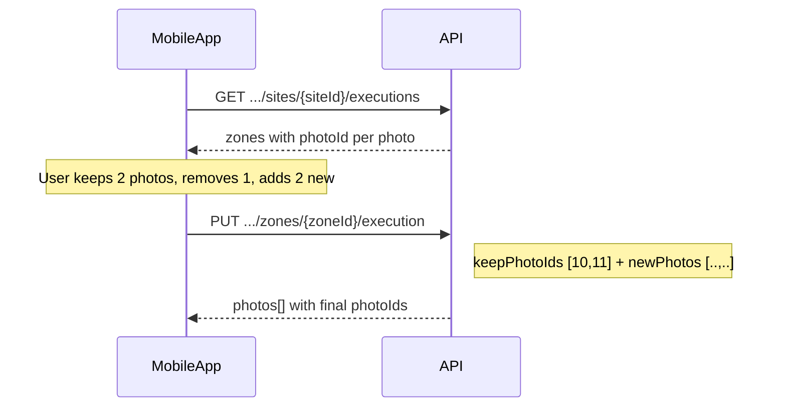

# Submit Zone Execution API

## Overview

This endpoint submits or updates the execution of a **single VM campaign zone** for one site.

It supports two request modes:

1. **Delta mode (recommended)** — `keepPhotoIds` + `newPhotos`: keep selected existing photos, remove others, add new ones.
2. **Legacy replace-all mode** — `photos` only: replaces every photo on the zone (backward compatible).

Each call:

- Validates the campaign, site, and zone assignment
- Creates or reuses a `VmExecutionSubmission` for the site
- Upserts a `VmExecution` for the given zone
- Auto-finalizes the site submission when **all required zones** have at least one photo

The HTTP method is **`PUT`** so the same route can be used to update a zone the user has already submitted.

## Endpoint

| Property | Value |
| --- | --- |
| **Method** | `PUT` |
| **Route** | `/api/VmCompaign/{campaignId}/sites/{siteId}/zones/{zoneId}/execution` |
| **Controller** | `VmCompaignController.SubmitZoneExecution` |
| **Authorization** | `RequireVMLeadOrMerchandiser` |

### Authorization

The caller must be authenticated with a JWT that includes one of:

- `IsVisualMerchandisingLead` = `"True"`
- `IsVisualMerchandiser` = `"True"`

The user id is read from claims (`userId`, `UserID`, `NameIdentifier`, or `Name`) and stored on photos and the submission.

## Path Parameters

| Name | Type | Required | Description |
| --- | --- | --- | --- |
| `campaignId` | `int` | Yes | Campaign identifier |
| `siteId` | `int` | Yes | Boutique/site identifier |
| `zoneId` | `int` | Yes | VM guideline zone identifier (`VmGuidelineZone.Id`) |

## Request Modes

### Mode detection

| Condition | Mode |
| --- | --- |
| `keepPhotoIds` and/or `newPhotos` present in JSON | **Delta mode** |
| Only `photos` provided (no `keepPhotoIds` / `newPhotos` keys) | **Legacy replace-all** |

At least one photo must remain after the operation (`keepPhotoIds` count + successfully added `newPhotos` ≥ 1).

Photo IDs for `keepPhotoIds` come from `GET .../executions` (`photos[].photoId`) or from the `photos[].photoId` field in the PUT response.

### Delta mode (recommended)

```json
{
  "keepPhotoIds": [101, 102],
  "newPhotos": [
    {
      "fileName": "vitrine-03.jpg",
      "mimeType": "image/jpeg",
      "contentBase64": "<base64>",
      "capturedAt": "2026-05-18T09:15:00Z"
    }
  ],
  "submittedAt": "2026-05-18T09:15:00Z",
  "meta": {
    "appVersion": "2.1.0",
    "platform": "android"
  }
}
```

| Scenario | `keepPhotoIds` | `newPhotos` |
| --- | --- | --- |
| Keep all + add more | All current IDs | New items |
| Remove one + add one | IDs to keep (omit removed ID) | New items |
| Remove one only | IDs to keep | `[]` |
| Replace all | `[]` | All new items |
| First submit (no existing photos) | `[]` | New items |

### Legacy replace-all mode

```json
{
  "photos": [
    {
      "fileName": "vitrine-01.jpg",
      "mimeType": "image/jpeg",
      "contentBase64": "<base64-encoded image bytes>",
      "capturedAt": "2026-05-18T09:15:00Z"
    }
  ],
  "submittedAt": "2026-05-18T09:15:00Z",
  "meta": {
    "appVersion": "2.1.0",
    "platform": "android"
  }
}
```

Deletes all existing zone photos and saves only the photos in `photos`.

### Request Fields

| Field | Type | Mode | Description |
| --- | --- | --- | --- |
| `keepPhotoIds` | `int[]?` | Delta | Server photo IDs to **keep**. Omitted IDs are deleted. |
| `newPhotos` | `SubmitCampaignPhotoDto[]?` | Delta | New photos to add (Base64). |
| `photos` | `SubmitCampaignPhotoDto[]?` | Legacy | Replaces all zone photos when delta fields are omitted. |
| `photos[].fileName` | `string` | Both | Original file name (used for extension when saving). |
| `photos[].mimeType` | `string` | Both | Allowed: `image/jpeg`, `image/jpg`, `image/png`, `image/webp` |
| `photos[].contentBase64` | `string` | Both | Raw image bytes as Base64 (no data-URL prefix). |
| `photos[].capturedAt` | `datetime?` | Both | Capture time (UTC). Defaults to server time if omitted. |
| `submittedAt` | `datetime` | Both | Execution timestamp. Defaults to `DateTime.UtcNow`. |
| `meta` | `object?` | Both | Client metadata stored on the submission. |
| `meta.appVersion` | `string?` | Both | Mobile app version. |
| `meta.platform` | `string?` | Both | e.g. `android`, `ios`. |

## Success Response (`200 OK`)

```json
{
  "success": true,
  "submissionId": "sub_a1b2c3d4e5f6",
  "submissionStatus": "Processing",
  "campaignStatus": "InProgress",
  "campaignReviewStatus": "PendingReview",
  "zoneId": 3,
  "processedPhotos": 1,
  "totalPhotos": 3,
  "isLastZone": false,
  "message": "Zone execution saved successfully.",
  "errors": [],
  "photos": [
    {
      "photoId": 101,
      "url": "/uploads/vm-execution/abc.jpg",
      "fileName": "abc.jpg",
      "uploadedDate": "2026-05-18T08:00:00Z",
      "uploadedByUserId": 12
    },
    {
      "photoId": 102,
      "url": "/uploads/vm-execution/def.jpg",
      "fileName": "def.jpg",
      "uploadedDate": "2026-05-18T08:05:00Z",
      "uploadedByUserId": 12
    },
    {
      "photoId": 105,
      "url": "/uploads/vm-execution/ghi.jpg",
      "fileName": "ghi.jpg",
      "uploadedDate": "2026-05-18T09:15:00Z",
      "uploadedByUserId": 12
    }
  ]
}
```

When `isLastZone` is `true`, `submissionStatus` is `Submitted` and `message` indicates the campaign was submitted for the site.

### Response Fields

| Field | Type | Description |
| --- | --- | --- |
| `success` | `bool` | `true` when the zone was saved successfully. |
| `submissionId` | `string?` | Public submission reference (e.g. `sub_a1b2c3d4e5f6`). |
| `submissionStatus` | `string?` | `Processing` while zones remain; `Submitted` when all required zones are complete. |
| `campaignStatus` | `string?` | Global campaign status after recompute (when `isLastZone` is `true`). |
| `campaignReviewStatus` | `string?` | Campaign review status after recompute (when `isLastZone` is `true`). |
| `zoneId` | `int` | Zone from the route. |
| `processedPhotos` | `int` | Number of **new** photos added in this request. |
| `totalPhotos` | `int` | Total photos on the zone after this request. |
| `isLastZone` | `bool` | `true` when this call completed the last required zone for the site. |
| `message` | `string` | Localized success message. |
| `errors` | `array` | Empty on success. |
| `photos` | `array` | Final photo list for the zone (use `photoId` for the next delta PUT). |

### `submissionStatus` Values

| Value | Meaning |
| --- | --- |
| `Pending` | Submission record created, not yet processing. |
| `Processing` | At least one zone saved; not all required zones complete. |
| `Submitted` | All required zones for the site have photos. |
| `Validated` | Set by review flow (not by this endpoint). |
| `Rejected` | Set on validation or processing failure. |

## Business Rules

1. **One submission per site** — `(campaignId, siteId)` shares a single `VmExecutionSubmission`.
2. **Delta mode** — Photos not listed in `keepPhotoIds` are deleted from disk and database. `newPhotos` are appended.
3. **Legacy mode** — All existing photos are removed; only `photos` from the body are stored.
4. **Minimum one photo** — The zone must have at least one photo after the operation.
5. **Valid keep IDs** — Each `keepPhotoIds` entry must belong to the current zone execution; otherwise `INVALID_KEEP_PHOTO_ID`.
6. **Zone must belong to the campaign** — Otherwise `400` with `ZoneNotAssigned`.
7. **Campaign window** — Rejected if cancelled or outside `[StartDate, EndDate]`.
8. **Auto-finalization** — When all required zones have photos in the submission → `Submitted` + activity log.
9. **Re-submission** — If submission was `Submitted`/`Validated`, a new PUT sets it back to `Processing` until all zones are complete again.

## Client Workflow (delta mode)



Recommended integration:

1. `GET /api/VmCompaign/{campaignId}/sites/{siteId}/executions` — load current `photoId` values
2. Build `keepPhotoIds` from photos the user did not remove
3. Put new captures in `newPhotos`
4. `PUT .../zones/{zoneId}/execution`
5. Update local state from response `photos`
6. When `isLastZone` is `true`, show summary / `execution-details`

## Error Responses

### `400 Bad Request` — Invalid payload

```json
{
  "success": false,
  "zoneId": 3,
  "message": "Invalid request payload.",
  "errors": []
}
```

### `400 Bad Request` — Photo validation

```json
{
  "success": false,
  "zoneId": 3,
  "campaignStatus": "InProgress",
  "campaignReviewStatus": "PendingReview",
  "message": "Submission contains invalid zone/photo data.",
  "errors": [
    { "zoneId": 3, "code": "INVALID_KEEP_PHOTO_ID" }
  ]
}
```

| `errors[].code` | Description |
| --- | --- |
| `NO_PHOTOS` | No photos left after the operation, or nothing sent in legacy mode. |
| `INVALID_KEEP_PHOTO_ID` | A `keepPhotoIds` value is not on this zone execution. |
| `INVALID_IMAGE_FORMAT` | `mimeType` is not jpeg/png/webp. |
| `INVALID_BASE64` | `contentBase64` is not valid Base64. |

### `400 Bad Request` — Business rules

| Condition | `message` (localized key) |
| --- | --- |
| Campaign cancelled | `CampaignClosed` |
| Outside campaign dates | `CampaignOutOfWindow` |
| Zone not in campaign | `ZoneNotAssigned` |

### `404 Not Found`

| Condition | `message` |
| --- | --- |
| Campaign does not exist | `CampaignNotFound` |
| Site not assigned to campaign | `CampaignOrSiteNotFound` |

### `500 Internal Server Error`

```json
{
  "success": false,
  "zoneId": 3,
  "message": "An internal error occurred while processing the submission."
}
```

## Storage

Photos are saved under:

```text
wwwroot/uploads/vm-execution/{guid}.{extension}
```

Response URLs use the form `/uploads/vm-execution/{fileName}`.

## Related Endpoints

| Method | Route | Purpose |
| --- | --- | --- |
| `GET` | `/api/VmCompaign/{campaignId}/sites/{siteId}/executions` | Zone list, `photoId` per photo |
| `GET` | `/api/VmCompaign/{campaignId}/sites/{siteId}/execution-details` | Detailed execution view |
| `POST` | `/api/VmCompaign/{campaignId}/sites/{siteId}/submit` | Legacy bulk submit (all zones) |
| `POST` | `/api/VmCompaign/executions/{executionId}/review` | Review a single zone execution |

## Example Requests

### Delta: keep 2 photos, add 1 new

```http
PUT /api/VmCompaign/1009/sites/42/zones/3/execution HTTP/1.1
Authorization: Bearer <token>
Content-Type: application/json

{
  "keepPhotoIds": [101, 102],
  "newPhotos": [
    {
      "fileName": "vitrine-03.jpg",
      "mimeType": "image/jpeg",
      "contentBase64": "/9j/4AAQSkZJRgABAQ...",
      "capturedAt": "2026-05-18T10:30:00Z"
    }
  ],
  "submittedAt": "2026-05-18T10:30:00Z",
  "meta": { "appVersion": "2.1.0", "platform": "ios" }
}
```

### Legacy: replace all photos

```http
PUT /api/VmCompaign/1009/sites/42/zones/3/execution HTTP/1.1
Authorization: Bearer <token>
Content-Type: application/json

{
  "photos": [
    {
      "fileName": "zone-vitrine.jpg",
      "mimeType": "image/jpeg",
      "contentBase64": "/9j/4AAQSkZJRgABAQ..."
    }
  ]
}
```

## Source Files

| File | Role |
| --- | --- |
| `Controllers/VmCompaignController.cs` | HTTP endpoint and error mapping |
| `Services/VmCompaignService/VmCompaignService.cs` | `SubmitZoneExecutionAsync` |
| `DTO/VmCompaignDtos/SubmitExecutionDtos/SubmitZoneExecutionDtos.cs` | Request/response DTOs |
| `DTO/VmCompaignDtos/SubmitExecutionDtos/SubmitCampaignExecutionDtos.cs` | Shared photo and meta DTOs |
